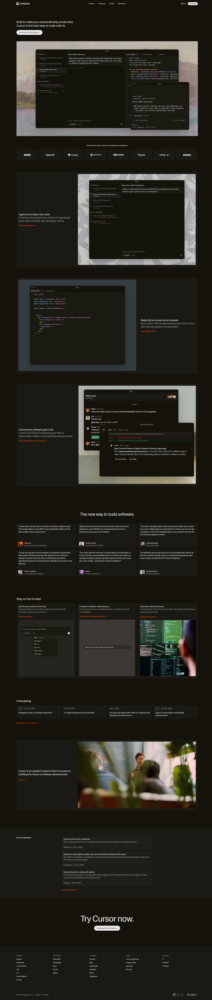

# Cursor Landing Page Clone

This project is a **desktop-first recreation of the Cursor developer tool landing page**, built as part of a web development assignment.  
The goal was to achieve **visual and structural accuracy**, closely matching the original Cursor website in layout, typography, and hierarchy.

🔗 **Live Site:**  
https://codetechguy.github.io/chaicode_cursorLandingPage/

📂 **GitHub Repo:**  
https://github.com/CodeTechGuy/Chaicode_cursorLandingPage

---

## Sections Recreated

- Top Navigation Bar (dark theme)
- Hero Section with product screenshot
- Trusted By / Logos
- Feature Sections (two-column layout)
- Feature Cards Grid
- Testimonials
- Use Cases / Stories
- Changelog / Updates
- Team / About Section
- Final Call-To-Action
- Footer

---

## Tech Stack

- HTML5  
- CSS3  

---

## Fonts & Colors

- **Font Used:** CursorGothic-Regular  
- Colors and visual styling closely match the original Cursor website.

🔗 Brand Assets: https://brandfetch.com/cursor.com

---

## Constraints Followed

- HTML & CSS only  
- No JavaScript, TailwindCSS, or animations  
- Desktop-only layout  
- Images and icons inspired by the original Cursor website  

---

## Project Demo

## Notes

This project was created for **learning and assignment purposes**.  
All design inspiration and credit belong to **Cursor**.

---

## Author

**CodeTechGuy**  
Web Development Cohort Assignment
